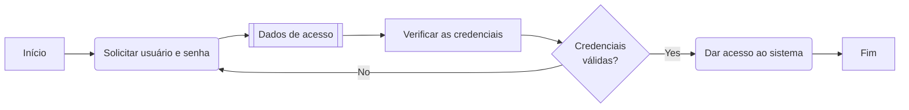
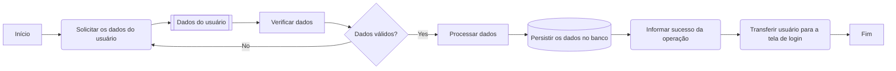
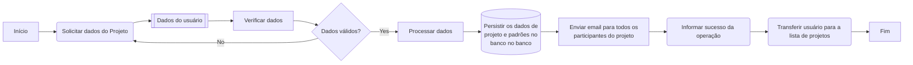

# Diagramas de fluxo do sistema

## Login

```mermaid
graph LR;
  A[Início] --> B(Solicitar usuário e senha);
  B --> C[[Dados de acesso]];
  C --> D[Verificar as credenciais];
  D --> E{"`Credenciais
    válidas?`"};
  E --> |Yes| F(Dar acesso ao sistema);
  F --> G[Fim];
  E ---->|No| B;
```

## Signup

```mermaid
graph LR;
  A[Início] --> B(Solicitar os dados do usuário);
  B --> C[[Dados do usuário]];
  C --> D[Verificar dados];
  D --> E{Dados válidos?};
  E --> |Yes| F[Processar dados];
  F --> G[(Persistir os dados no banco)];
  G --> H(Informar sucesso da operação);
  H --> I(Transferir usuário para a tela de login);
  I --> J[Fim];
  E ---->|No| B;
```

## Create Project

```mermaid
graph LR;
  A[Início] --> B(Solicitar dados do Projeto);
  B --> C[[Dados do usuário]];
  C --> D[Verificar dados];
  D --> E{Dados válidos?};
  E --> |Yes| F[Processar dados];
  F --> G[("`Persistir os dados de
    projeto e padrões no
    banco no banco`")];
  G --> H["`Enviar email para todos os
    participantes do projeto`"];
  H --> I(Informar sucesso da operação);
  I --> J(Transferir usuário para a lista de projetos);
  J --> K[Fim];
  E ---->|No| B;
```
